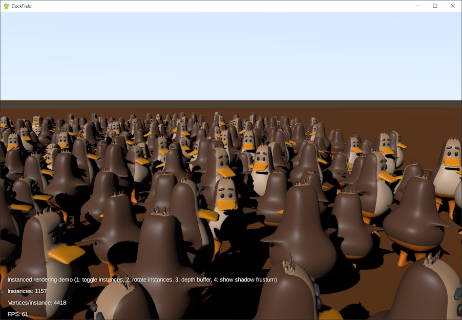

# DuckField

A [libGDX](https://libgdx.com/) project generated with [gdx-liftoff](https://github.com/tommyettinger/gdx-liftoff).



A demonstrator of instancing of a gltf model in combination with the PBR shader of gdx-gltf.
Requires OpenGL ES 3.0.

(Updated version of my Corn Field repo, to address lighting issues).

Note: GLTF models need to be exported from Blender using GLTF Separate, not GLTF Embedded.

Update: the derived PBR shader provider allows to combine instanced rendering of some assets with normal rendering of other assets, applying the relevant shader as needed.
The PBR depth shader is also subclassed to allow shadows from the corn stalks.


How it works:
When I create the SceneManager, I pass a subclassed shader provider and a subclassed depth shader provider.
```
sceneManager = new SceneManager( new MyPBRShaderProvider(), new MyPBRDepthShaderProvider() );
```
These are just there to substitute a subclassed shader instead of PBRShader or PBDDepthShader, with two differences:
- if the renderable's mesh is an instanced mesh, then add a line to the shader prefix to define 'instanced'
- substitute a vertex shader that has been adapted from the original PBR vertex shader to modify vertex positions if 'instanced' is defined (more on this later).


```
    @Override
    protected PBRShader createShader(Renderable renderable, PBRShaderConfig config, String prefix){
        if( renderable.meshPart.mesh.isInstanced()) {
            prefix += "#define instanced\n";
        }
        config.vertexShader = Gdx.files.internal("shaders/pbr-instanced.vs.glsl").readString();
        return new MyPBRShader(renderable, config, prefix);
    }
```

The derived PBR shader passes almost everything to PBRShader, except that canRender() returns false if the shader was created for instanced renderables
and receives a non-instanced renderable or vice versa.  We want the shader with the extra prefix line mentioned before only to be used for instanced renderables.
So we use the logic in canRender() to force the use of the correct shader instance per renderable.

```
public class MyPBRShader extends PBRShader {

    private boolean isInstancedShader;

    public MyPBRShader(Renderable renderable, Config config, String prefix) {
        super(renderable, config, prefix);
        isInstancedShader = renderable.meshPart.mesh.isInstanced();
    }

    @Override
    public boolean canRender(Renderable renderable) {
        if(renderable.meshPart.mesh.isInstanced() != isInstancedShader ) {
            return false;
        }
        return super.canRender(renderable);
    }
}
```


So what are the changes made in the vertex shader?

The attribute vec4 i_offset is defined if 'instance' is defined. This will contain the data of the instance. And we define a little function to provide a rotation matrix
in the horizontal plane.


    #if defined(instanced)
        attribute vec4 i_offset;       // instanced data (X, scale Y, Z, rotation angle around Y)
        
        mat2 rotate(float angle) {
            return mat2(
                cos(angle), -sin(angle),
                sin(angle), cos(angle)
                );
        }
    #endif // instanced

Then we add some conditional code to modify the vertex position vector just before it is emitted via gl_Position:

    ...
    // vec4 pos is world position of the vertex

    #if defined(instanced)
        pos.xz = rotate(i_offset.w)*pos.xz;             // rotate around Y axis
        pos.y *= i_offset.y;                            // scale in Y direction
        pos += vec4(i_offset.x, 0, i_offset.z, 0.0);    // offset in horizontal plane
    #endif

    v_position = vec3(pos.xyz) / pos.w;
    gl_Position = u_projViewTrans * pos;


The type of instance data you want to use depends on your particular application.
In this particular test the instance data uses 4 floats to modify each vertex:
- 2 floats to translate in the horizontal (XZ) plane
- 1 float to scale in the upwards direction (Y)
- 1 float to rotate around the up axis (Y)

The changes to the depth vertex shader are very similar.


## Platforms

- `core`: Main module with the application logic shared by all platforms.
- `lwjgl3`: Primary desktop platform using LWJGL3.
- `html`: Web platform using GWT and WebGL. Supports only Java projects.  NOT TESTED/NOT WORKING.
- `teavm`: Experimental web platform using TeaVM and WebGL.
